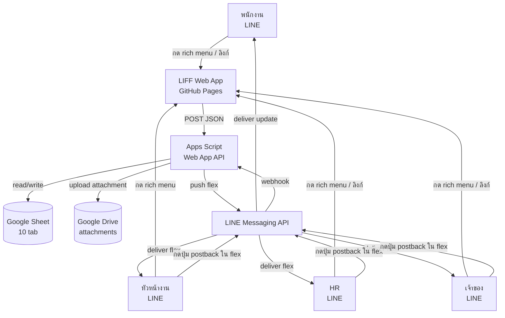
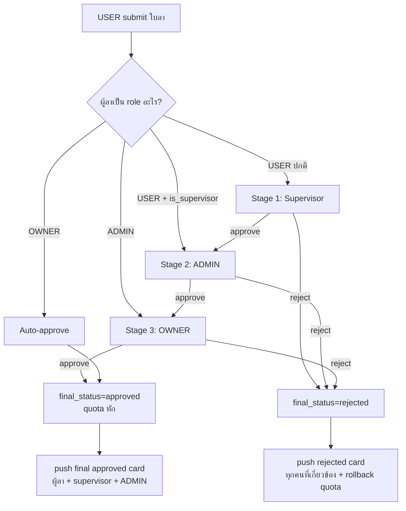

# Architecture — mena-leave

> **อ่านก่อน:** [CONTEXT.md](../CONTEXT.md)

---

## 1. ภาพรวมระบบ



---

## 2. Data Flow — 6 flow หลัก

### Flow A: Register (Visitor → User pending → ADMIN approve)

| # | Step | ใครทำ | ข้อมูล | ปลายทาง |
|---|---|---|---|---|
| 1 | กดลิงก์ register | Visitor | — | LIFF (register.html) |
| 2 | ตรวจสิทธิ์ — มี Users row หรือยัง | LIFF | lineUserId | Apps Script `/getMyStatus` |
| 3 | ถ้ายังไม่มี → แสดง form | LIFF | — | — |
| 4 | กรอก display_name, emp_code, phone, email, dept, position | Visitor | form | LIFF |
| 5 | submit | LIFF | JSON + lineUserId | `/submitRegister` |
| 6 | insert Users row status=pending | Apps Script | — | Sheet `Users` |
| 7 | push Flex card หา ADMIN ทุกคน | Apps Script | flex | LINE |
| 8 | ADMIN กด approve ใน flex | ADMIN | postback `action=approve_register&id=EMP-XXXX` | LINE → webhook |
| 9 | set Users.status=active + create LeaveQuota row | Apps Script | — | Sheet |
| 10 | push confirm flex หา user + reply ตอบ ADMIN | Apps Script | flex | LINE |

### Flow B: Submit Leave (User → Supervisor)

| # | Step | ใครทำ | ข้อมูล | ปลายทาง |
|---|---|---|---|---|
| 1 | กด rich menu "ส่งใบลา" | User | — | LIFF (request.html) |
| 2 | โหลด quota + rules | LIFF | lineUserId | `/getApprovalConditions` |
| 3 | แสดง quota คงเหลือ + กฎ | LIFF | — | — |
| 4 | กดต่อ → กรอก leave_type, date_from, date_to, reason, attachment (optional) | User | form | LIFF |
| 5 | กด "ส่ง" → request GPS | LIFF | navigator.geolocation | browser |
| 6 | ถ้า deny → block + แสดง friendly error | LIFF | — | — |
| 7 | ถ้ามี attachment → resize 1280px JPEG | LIFF | base64 | — |
| 8 | submit | LIFF | JSON + gps + base64 | `/submitLeave` |
| 9 | validate quota / rules / GPS / dates | Apps Script | — | — |
| 10 | upload attachment → Drive | Apps Script | base64 | Drive `leave-proofs/` |
| 11 | insert LeaveRequests row + reserve quota | Apps Script | — | Sheet |
| 12 | lookup supervisor (Supervisors sheet) | Apps Script | user_id | — |
| 13 | branch:<br/>(a) user เป็น USER ปกติ → push Stage1 flex หา supervisor<br/>(b) user.is_supervisor=TRUE → skip → ไป Stage 2<br/>(c) user เป็น ADMIN → skip → ไป Stage 3<br/>(d) user เป็น OWNER → auto-approve | Apps Script | — | LINE / Sheet |
| 14 | reply ผู้ลา flex "ส่งแล้ว ส่งต่อหัวหน้างาน" | Apps Script | flex | LINE → User |

### Flow C: Stage 1 Approve (Supervisor → HR)

| # | Step | ใครทำ | ข้อมูล | ปลายทาง |
|---|---|---|---|---|
| 1 | Supervisor กดปุ่ม approve ใน Stage1 flex | Supervisor | postback `action=approve_leave&id=LV-XXX&stage=1&decision=approve` | LINE → webhook |
| 2 | backend verify: ผู้กดเป็น supervisor ของ leave.user_id จริงไหม | Apps Script | — | — |
| 3 | ถ้าใช่ → set stage1_status=approved, stage1_by, stage1_at | Apps Script | — | Sheet |
| 4 | push Stage2 flex หา ADMIN ทุกคน | Apps Script | flex | LINE |
| 5 | push update card หาผู้ลา "หัวหน้างานอนุมัติแล้ว รอ HR" | Apps Script | flex | LINE → User |
| 6 | reply Supervisor "อนุมัติเรียบร้อย" | Apps Script | text | LINE |

### Flow D: Stage 2 Approve (HR → Owner)
- เหมือน Flow C แต่ stage=2 + verify isAdmin + push Stage3 หา OWNER
- 1st ADMIN ที่กด wins (rest จะเห็น error "ตัดสินใจไปแล้ว")

### Flow E: Stage 3 Approve (Owner → final)
- เหมือน Flow D แต่ stage=3 + verify isOwner
- 1st OWNER wins
- ตอน approved → commitQuota (used += days, reserved -= days)
- push final flex หาผู้ลา + supervisor + ADMIN
- update Audit_Log

### Flow F: Reject ใดๆ
- rejectAtAnyStage → final_status=rejected
- rollbackQuota (reserved -= days)
- push reject flex หา:
  - ผู้ลา (พร้อม note ของผู้ปฏิเสธ)
  - ทุก approver ที่ผ่านมา (rejected by [name] at stage N)

---

## 3. Sheet Structure
ดู [CONTEXT.md § 4 Data Model](../CONTEXT.md#4-data-model)

---

## 4. Setup Plan

- [ ] Step 1: รัน `setupAll()` ใน Apps Script editor
- [ ] Step 2: สร้าง LINE Messaging API channel + LIFF apps (8 ตัว) + Published
- [ ] Step 3: ใส่ secret manual ใน Script Properties (LINE_CHANNEL_ACCESS_TOKEN + SECRET)
- [ ] Step 4: แก้ NON_SECRET_PROPS ใน Setup.gs (LIFF IDs ทั้ง 8) + รัน setupProperties()
- [ ] Step 5: Deploy Apps Script Web App (Anyone) → copy URL
- [ ] Step 6: update `liff/js/config.js` API_URL + push GitHub
- [ ] Step 7: enable GitHub Pages + รอ deploy
- [ ] Step 8: update LIFF endpoint URLs ใน LINE Developers (8 ตัว)
- [ ] Step 9: ตั้ง LINE webhook URL = web app URL
- [ ] Step 10: รัน `setup_rich_menu.py` upload rich menu
- [ ] Step 11: รัน `bootstrapFirstOwner('Uxxx...')` ใส่ LINE userId พี่ปุ้ย
- [ ] Step 12: ทดสอบ flow ผ่าน LIFF จริง (TASKS.md TASK-37)
- [ ] Step 13: รัน `setupTriggers()`

---

## 5. Edge Cases

| สถานการณ์ | วิธีรับมือ | implement ที่ |
|---|---|---|
| Visitor register ซ้ำ | block + แจ้ง "รอ HR อนุมัติ" | Register.gs::submitRegister |
| ลาทับโควตา | block ก่อน submit + แสดง quota คงเหลือ | LeaveRequest.gs::validateLeavePayload_ |
| ลาทับวันที่อนุมัติแล้ว | warn + แสดงรายการที่ทับ (ปุ่ม "ส่งต่อ" ก็ได้) | LeaveRequest.gs |
| หัวหน้างานลาเอง | skip stage 1 → ตรงไป stage 2 | Approval.gs::initStages_ |
| ADMIN ลาเอง | skip stage 1+2 → stage 3 | Approval.gs |
| OWNER ลาเอง | auto-approve + log audit | Approval.gs |
| ลาย้อนหลัง (sick ฉุกเฉิน) | อนุญาตเฉพาะ leave_type=sick + แสดง note ขอใบรับรอง | LIFF + backend validate |
| GPS deny | block + friendly error "เปิด GPS เพื่อยืนยันสถานที่" | request.html |
| GPS timeout | retry 1 ครั้ง + ถ้ายังไม่ได้ → block | request.html |
| Attachment ใหญ่ | resize 1280px JPEG 85% ใน utils.fileToResizedBase64 | utils.js |
| Apps Script timeout 6 นาที | LeaveRequest แค่ insert + push → ไม่หนัก | constraint check |
| LINE push fail | retry 3 ครั้ง exponential backoff | LineApi.gs |
| 1st ADMIN ตัดสินแล้ว, ADMIN คนที่ 2 กดอนุมัติ | reply "ตัดสินใจไปแล้วโดย [name]" | Approval.gs::approveLeave |
| Supervisor offline นาน → ใบลาคาที่ Stage 1 | HR ใช้ admin.html "escalate" ข้ามไป stage 2 ได้ | Approval.gs::escalateLeave |
| ปฏิเสธชั้นกลาง | rollback quota + notify ทุกชั้นที่ผ่านมา | Approval.gs |
| Pairing code expired | แสดง error + ปุ่ม "ขอใหม่" → notify ADMIN | Pairing.gs |
| พนักงานออก (offboard) | ADMIN set status=inactive (ไม่ลบ data + audit) | Admin.gs::setUserStatus |
| Supervisor ออก | invalidate ทุก row ของ Supervisors ที่ supervisor_user_id = นี้ + แจ้ง HR pair ใหม่ | Admin.gs::setUserStatus |
| Year-end → quota reset | yearly cron 1 ม.ค. + log audit | Quota.gs::resetQuotaYearly |
| ADMIN เปลี่ยน rules — Pending_Changes | OWNER approve ก่อน apply | Rules.gs + Admin.gs |

---

## 6. Approval flow visual



---

## 7. Quota state machine

```
total: 30 (ตั้งโดย HR)
used:  0  (commit เมื่อ final approved)
reserved: 0 (ตอน submit + lock ระหว่างรออนุมัติ)

available = total - used - reserved

State transitions:
  submit:           reserved += days  (available -= days)
  final_approved:   used += days, reserved -= days  (available unchanged ถ้าไม่มี race)
  rejected:         reserved -= days  (available += days, คืนสิทธิ์)
  yearly_reset:     new row ปีถัดไป (used=0, reserved=0, carry vacation? per Settings)
```

---

## 8. Next Steps
- [ ] แตก TASKS.md ให้ละเอียด (ทำแล้ว — 38 tasks)
- [ ] Build ตาม phase
- [ ] Update doc นี้เมื่อ architecture เปลี่ยน
